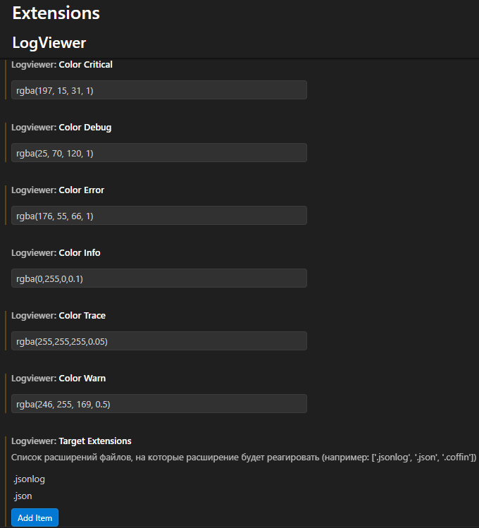

🖼 Принцип работы
При открытии файла .json или .jsonlog форматирование применяется автоматически для файлов не более 50 мегабайт (Ограничение VsCode для расширений)
До:
```cpp
{"Date":"2025-09-15 14:08:22.183431000", "ModuleName":"Transport", "LogLevel":"debug", "Title":"Send keyResponse","Host":"::ffff:10.0.0.221","Port":47845}
```

После:
```cpp
[14:08:22:183] [ Transport    ] [           ] [D] Send keyResponse Host[::ffff:10.0.0.221] Port[47845]
```

⚙️ Настройки

В настройках расширения LogViewer (Ctrl + , -> Extensions -> LogViewer) можно настроить цвета форматирования логов


Настройки выглядят следующим образом



⚠️ Изменения применяются сразу, без перезапуска VS Code.

📌 Статус-бар

Внизу редактора отображается кнопка FormatLog для быстрого форматирования текущего файла.
Кнопка показывается только если открыт файл с расширением.jsonlog или .json

📄 Лицензия

MIT License.
