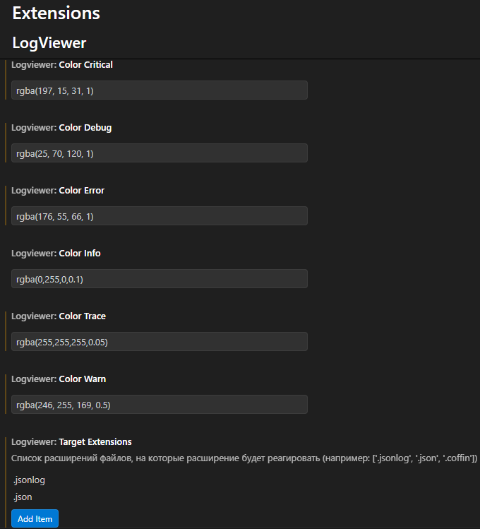

# 🖼 Принцип работы

При открытии файла .json или .jsonlog форматирование применяется автоматически (Набор расширений с автоматическим форматированием можно изменить в настройках)
До:
```cpp
{"Date":"2025-09-15 14:08:22.183431000", "ModuleName":"Transport", "LogLevel":"debug", "Title":"Send keyResponse","Host":"::ffff:10.0.0.221","Port":47845}
```

После:
```cpp
[14:08:22:183] [ Transport    ] [           ] [D] Send keyResponse Host[::ffff:10.0.0.221] Port[47845]
```

# ⚙️ Настройки

В настройках расширения LogViewer (Ctrl + , -> Extensions -> LogViewer) можно настроить:

1. Цвета отформатированных логов


2. Указать расширения файлов по умолчанию, на которые работает автоматический запуск форматирования при открытии



⚠️ Изменения применяются сразу, без перезапуска VS Code.

# 📌 Статус-бар

Внизу редактора отображается кнопка FormatLog для быстрого форматирования текущего файла.
Кнопка показывается только если открыт файл с расширением указанным в настройках

# 📄 Лицензия

MIT License.
